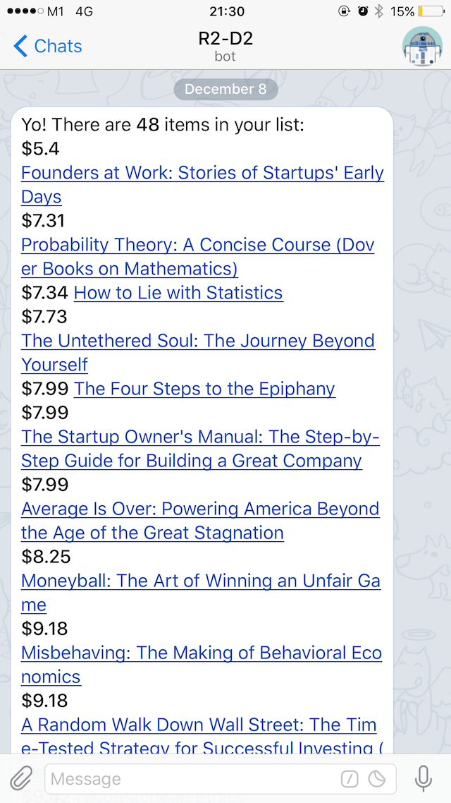

# amazon-list-telegram-bot-cli

> Send an Amazon wish list/shopping list from a Telegram Bot to you



## Install

```
$ npm install --global amazon-list-telegram-bot-cli
```

## Usage

```
$ amazon-list-telegram-bot-cli --help

  Usage
    $ amazon-list-telegram-bot-cli <amazon-list-url> <telegram-bot-token> <telegram-chat-id>

  Example
    $ amazon-list-telegram-bot-cli 'https://www.amazon.com/gp/registry/wishlist/XXX' 'YYY' 'ZZZ'

    (replace XXX, YYY, ZZZ with your Amazon list ID, Telegram bot token and chat ID)
    (You can also provide a list URL with filter and sort params, e.g. ?sort=universal-price&filter=price-drop)
```

## Related

- [amazon-list-scraper](https://github.com/luugiathuy/amazon-list-scraper) - API for this module

## License

MIT © [Luu Gia Thuy](http://luugiathuy.com)
